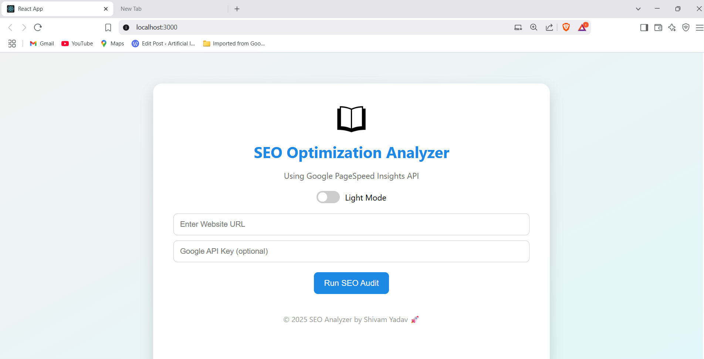

# 🚀 SEO Optimization Analyzer

A professional-grade SEO audit web app built with **React.js** and **Node.js**, styled like Flipkart/Meesho, featuring dark mode, PDF export, and real-time Google PageSpeed Insights integration.

## 🔥 Features

- 🎨 Modern responsive UI
- 🌗 Dark Mode Toggle
- 📄 Export results to PDF
- 📊 Google PageSpeed Insights API integration
- ⚡ Fully mobile responsive
- ☁️ Ready for deployment (Vercel + Render)

## 📸 Screenshot




---

## 📁 Folder Structure

```
seo-audit-app/
├── client/             # React Frontend
│   ├── public/
│   │   └── logo.png
│   └── src/
│       ├── App.js
│       ├── App.css
│       ├── ThemeToggle.js
│       └── index.js
├── server/             # Node.js Backend
│   ├── index.js
│   └── .env (contains GOOGLE_API_KEY)
├── .gitignore
├── package.json (root)
└── README.md
```

---

## 🚀 Getting Started

### 📦 1. Clone the repository

```bash
git clone https://github.com/your-username/seo-audit-app.git
cd seo-audit-app
```

### 🖥 2. Setup the backend

```bash
cd server
npm install
```

Create a `.env` file:

```env
GOOGLE_API_KEY=your_google_api_key_here
```

Start the backend server:

```bash
node index.js
```

### 🌐 3. Setup the frontend

In a second terminal:

```bash
cd client
npm install
npm start
```

Your app will run at `http://localhost:3000` and the backend at `http://localhost:5000`.

---

## 🌍 Deployment

### Frontend (Vercel)

- Push your repo to GitHub
- Import to [Vercel](https://vercel.com)
- Set `client/` as root directory

### Backend (Render)

- Go to [Render](https://render.com)
- Create a new Web Service using the `server/` folder
- Add environment variable: `GOOGLE_API_KEY`
- Set build command: `npm install`
- Set start command: `node index.js`

Update your frontend API URL in `App.js` to point to your Render backend.

---

## 📤 Export Feature

Click “Export PDF” after an audit to generate a styled downloadable report.

---

## 🙌 Credits

Built by **Shivam Yadav** 🚀  
MIT License